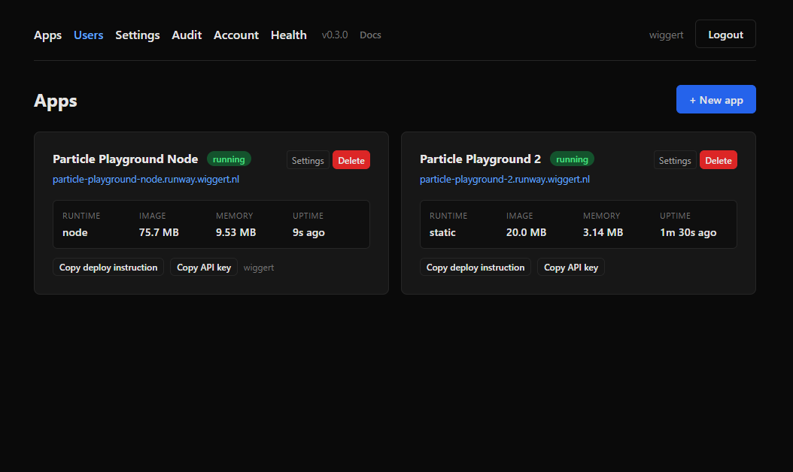
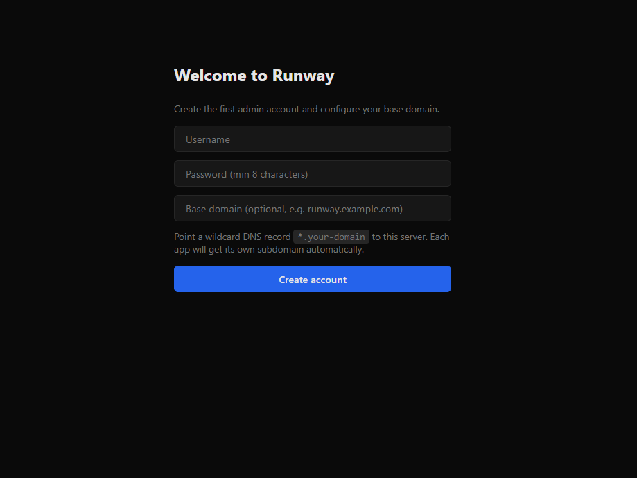
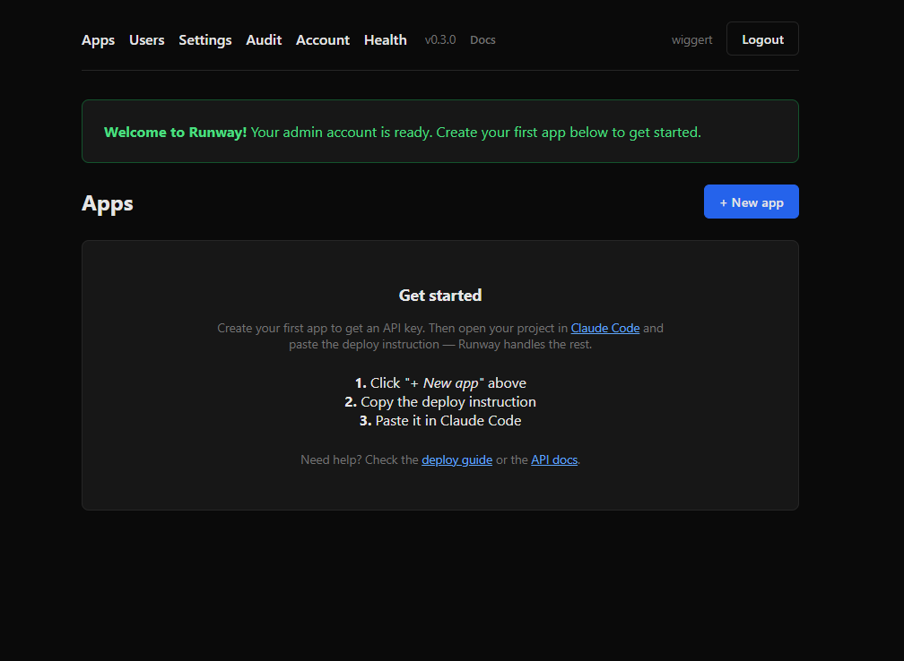
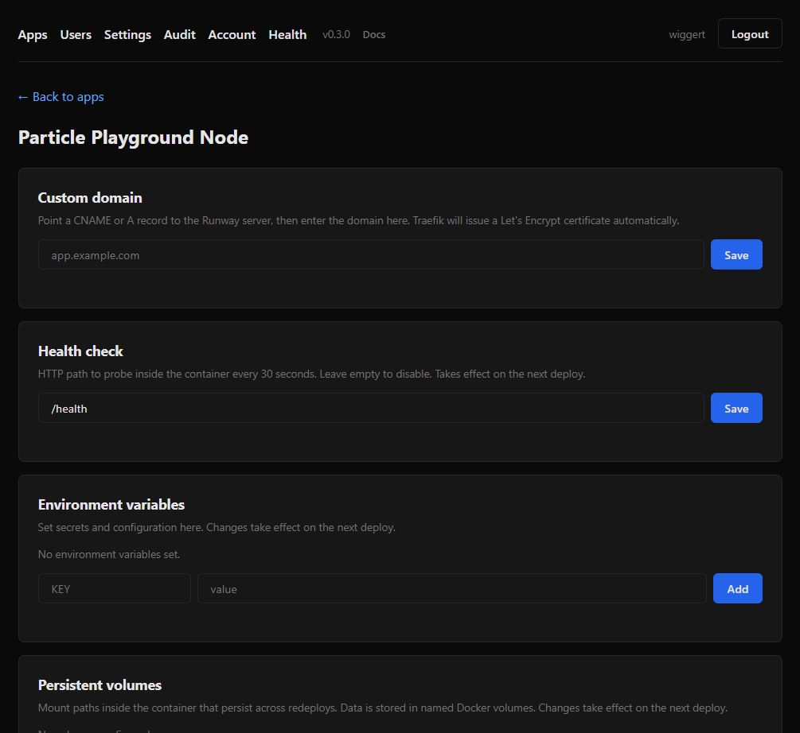

<p align="center">
  <h1 align="center">Runway</h1>
  <p align="center">
    <strong>Deploy AI apps to your own server with one prompt.</strong>
  </p>
  <p align="center">
    <a href="#install">Install</a> &middot;
    <a href="#how-it-works">How it works</a> &middot;
    <a href="#deploying-an-app">Deploy an app</a> &middot;
    <a href="#features">Features</a> &middot;
    <a href="#development">Development</a>
  </p>
</p>

---

Runway is an open-source platform that turns any Linux server into a
deployment target for AI applications. Install it with one command,
generate an API key, and tell Claude Code to deploy — it handles
Dockerfiles, builds, TLS certificates, and routing automatically.

No CI/CD pipelines to configure. No Kubernetes. Just your code and a
server.



## Why Runway?

- **One-prompt deploys** — tell Claude Code *"deploy this to Runway"*
  and it reads the API docs from your server, builds a Docker image,
  and puts it online with HTTPS.
- **Your server, your data** — runs on any VPS (Hetzner, DigitalOcean,
  your own hardware). Nothing leaves your infrastructure.
- **Zero config for simple apps** — Runway generates Dockerfiles for
  Node.js, Python, Go, and static sites. Bring your own Dockerfile for
  full control.
- **Production features built in** — environment variables, persistent
  volumes, custom domains, health checks, deploy rollback, 2FA, and
  audit logging.

## How it works

```
Your machine                            Your server
┌──────────────────┐                   ┌──────────────────────────────┐
│                  │                   │  Runway                      │
│  Claude Code     │── GET /llms.txt ─>│  ├─ Dashboard (web UI + API) │
│                  │── tar upload ────>│  ├─ BuildKit (isolated builds)│
│  "deploy this    │                   │  ├─ Traefik (TLS + routing)  │
│   to Runway"     │<── https://app ──│  └─ Your app containers      │
│                  │                   │                              │
└──────────────────┘                   └──────────────────────────────┘
```

1. **Install Runway** on your server with one command.
2. **Create an app** in the dashboard — you get an API key.
3. **Tell Claude Code** to deploy your project with that key.
4. **Your app is live** at `https://your-app.your-domain.com` with a
   Let's Encrypt certificate.

## Install

On a fresh Linux server (Ubuntu, Debian, CentOS, RHEL, Fedora, Rocky,
Alma):

```bash
curl -fsSL https://raw.githubusercontent.com/wiggertdehaan/Runway/main/install.sh \
  | sudo DASHBOARD_DOMAIN=runway.example.com ACME_EMAIL=you@example.com bash
```

**Requirements:**
- A domain name with a DNS A record pointing to the server
- A wildcard DNS record (`*.runway.example.com`) for automatic app subdomains
- Ports 80 and 443 open

The installer sets up Docker, configures the firewall, and starts the
Runway stack. Open `https://runway.example.com` to create your admin
account.

## Deploying an app

### Option A — zero install (recommended)

Your Runway server publishes its full API documentation at `/llms.txt`.
Claude Code fetches it and follows the instructions — no plugins or MCP
servers needed.

1. Create an app in the dashboard and copy the deploy instruction.
2. Open your project in Claude Code and paste it.
3. Done. Claude handles the Dockerfile, build, and deploy.

### Option B — MCP server

For power users who want structured tool calls instead of `curl`:

```bash
git clone https://github.com/wiggertdehaan/Runway.git
cd Runway && pnpm install && pnpm mcp:build

claude mcp add runway \
  -s project \
  -e RUNWAY_URL=https://runway.example.com \
  -e RUNWAY_APP_KEY=rwy_... \
  -- node $(pnpm mcp:path)
```

Then just say *"deploy this to Runway"* in any Claude Code session.

## Features

### Environment variables

Store secrets and configuration on the server — never bake them into
your Docker image. Set them via the dashboard, API, or MCP tools.
Changes take effect on the next deploy.


### Persistent volumes

Mount paths inside your container that survive redeploys. Backed by
named Docker volumes — perfect for SQLite databases, file uploads, or
caches.

### Custom domains

Point your own domain at any app. Traefik issues a Let's Encrypt
certificate automatically. Just add a DNS record and configure the
domain in the app settings.

### Health checks

Configure an HTTP endpoint to probe. Docker checks it every 30 seconds
and marks the container unhealthy after 3 failures — so you know when
something is actually broken, not just running.

### Deploy rollback

Bad deploy? Roll back to the previous working version with one API
call. Your env vars, volumes, and domain config stay untouched — only
the container image changes.

### Security

- Passwords hashed with scrypt, constant-time comparison
- CSRF protection (double-submit cookie with timing-safe comparison)
- Optional TOTP two-factor authentication with backup codes
- Login rate limiting (5 attempts / 15 minutes per IP), persisted in SQLite
- API rate limiting (60 requests / minute per IP)
- Per-app API keys, independent from dashboard sessions
- Audit log for all admin actions
- Content Security Policy headers
- Isolated builds via BuildKit (user code never touches the Docker socket)
- Traefik has zero Docker socket access

## Dashboard

The web dashboard lets you manage apps, users, and settings.

| Setup wizard | Empty state | App settings |
|:---:|:---:|:---:|
|  |  |  |

## Tech stack

| Component | Technology |
|-----------|-----------|
| Language | TypeScript |
| Runtime | Node.js 24 (`node:sqlite`) |
| Web framework | [Hono](https://hono.dev/) + [htmx](https://htmx.org/) |
| Containers | [dockerode](https://github.com/apocas/dockerode) + [BuildKit](https://github.com/moby/buildkit) |
| Reverse proxy | [Traefik](https://traefik.io/) (file provider) |
| TLS | Let's Encrypt (HTTP-01) |
| Agent protocol | [MCP](https://github.com/modelcontextprotocol/typescript-sdk) |
| Agent discovery | `/llms.txt` (plain Markdown) |

## Repository layout

```
runway/
├── install.sh             # One-command server bootstrap
├── docker-compose.yml     # Traefik + control plane + BuildKit
├── packages/
│   ├── control/           # Dashboard, REST API, deploy pipeline
│   └── mcp/               # MCP server for Claude Code
└── LICENSE
```

## Development

Requires Node.js 24+ and pnpm.

```bash
pnpm install
pnpm typecheck
pnpm --filter @runway/control dev   # Dashboard on http://localhost:3000
```

## Security notes

- **Passwords** are hashed with scrypt (via `node:crypto`), salted per user,
  and compared in constant time. Unknown usernames still run through the KDF
  to avoid leaking user existence via timing.
- **Two-factor authentication** is available via TOTP (any authenticator app).
  Ten single-use backup codes are generated when 2FA is enabled. Admins can
  reset another user's 2FA from the Users page (requires their own TOTP code).
- **CSRF protection** uses the double-submit cookie pattern with timing-safe
  comparison on all POST forms.
- **Sessions** are random 32-byte tokens stored in SQLite with a 30-day TTL.
  Cookies are `HttpOnly` and `SameSite=Lax`. Expired sessions are cleaned
  up hourly.
- **Login rate limiting** — after 5 failed password or 2FA attempts from the
  same IP within 15 minutes, further login attempts are blocked until the
  window expires. Rate limits are persisted in SQLite and survive restarts.
  Failed attempts are logged in the audit log with the source IP.
- **API rate limiting** — 60 requests per minute per IP on all `/api/v1/*`
  endpoints.
- **Traefik** is configured with the dashboard disabled. Do not add
  `--api.insecure=true` on a public server. Traefik does not have access
  to the Docker socket at all — routing is driven by YAML files in a
  shared volume managed by the control plane.
- **Builds are isolated** in a separate BuildKit container. User
  Dockerfiles execute inside BuildKit's containerd sandbox with zero
  access to the Docker socket. The control container still mounts the
  socket for container lifecycle (run/stop/logs).
- The **REST API** (`/api/v1/*`) uses Bearer-token auth with per-app keys,
  independent from the session cookie used by the web UI.
- The **deploy endpoint** accepts up to 100 MB of `application/x-tar` per
  request. The uploaded code is built as root inside Docker build, so
  treat API key holders as trusted.
- **Environment variables** are stored in SQLite and injected at container
  start. They are visible to authenticated dashboard users and API key
  holders; treat the dashboard and API keys as privileged access.
- **Health check paths** and **volume mount paths** are validated against
  strict character allowlists to prevent command injection and path
  traversal respectively.

## Roadmap

Planned improvements — contributions welcome:

- **Multiple custom domains per app** — currently limited to one custom domain plus the auto-generated subdomain
- **Security scanning on deploy** — scan uploaded code and images for vulnerabilities before going live
- **Deploy version history UI** — dashboard view of all deployed versions with one-click rollback to any point
- **Activity feed** — show recent deploys, status changes, and events on the dashboard
- **Multiple deploy targets** — support deploying to multiple servers from a single dashboard
- ~~Wildcard DNS check at setup~~ *(v0.3)*
- ~~System health check page~~ *(v0.3)*
- ~~First-app tutorial~~ *(v0.3)*
- ~~Better empty state~~ *(v0.3)*
- ~~Deploy failure notifications~~ *(v0.3 — webhook)*
- ~~Help link in UI~~ *(v0.3)*
- ~~Mask API tokens in dashboard~~ *(v0.3)*
- ~~Track app creator~~ *(v0.3)*
- ~~Faster dashboard loading~~ *(v0.3 — htmx lazy loading)*

## License

MIT — see [LICENSE](LICENSE).
